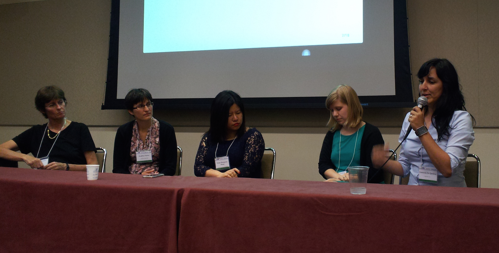

At this year's [useR! R Conference](http://user2014.stat.ucla.edu) at the the University of California's lovely Los Angeles campus, for the first time in the conference's history, an event was held focusing on the shortage of women in the R community. The **her panel** was organized by myself and Gabriela de Quieroz, founder of R-ladies, and included an impressive group of 5 female developers:

* [Heather Turner](http://www.heatherturner.net), Statistical consultant and co-author of the [gnm and gslcca](http://www.heatherturner.net/r-packages.html) packages
* [Karline Soetaert](http://www.nioz.nl/staff-detail?id=784400), Head of the Department of Ecosystem Studies, Royal Netherlands Institute of Sea Research and author of packages [deSolve](http://cran.r-project.org/web/packages/deSolve/index.html) and [FME](http://cran.r-project.org/web/packages/FME/index.html)
* [Amelia Mcnamara](http://www.stat.ucla.edu/~amelia.mcnamara/), PhD candidate in Statistics, UCLA
* [Vivian Shangxuan Zhang](https://www.linkedin.com/in/shangxuanzhang), CTO/Co-Founder of SupStat Inc, Founder of NYC Data Science Academy
* [Gabriela Queiroz](http://www.meetup.com/R-ladies/member/14534094/), Founder of R-ladies & Data Scientist at Alpine Data Labs

The panel discussed a number of challenging questions before a packed audience of male and female useRs. Multiple views from the panel and audience were shared. In case you missed the conversation, I wanted to summarize some of the major take-aways.

**R's gender gap**. The panel opened with a discussion of attempts Karline and I independently made to understand the percentage of women who are actively authoring R packages. Our estimates suggest that 10-15% of current packages on CRAN have been written by women (see the Figure below). It was less clear how many women are users of R, and there was a general call for research to get more accurate statistics on R's gender gap. 

Tim Hesterberg described a study Google conducted to understand possible barriers to women writing software. The findings were recently published as a report entitled [Women Who Choose Computer Science--What Really Matters?](www.google.com/edu/pdf/women-who-choose-what-really.pdf) That report identified 1) social encouragement, 2) self perception, 3) academic exposure, and 4) career perception as the key controllable factors influencing women's choice of a career in computer science. It would be important to determine if and how these same factors influence women's contributions to R.

**Which disciplines populate the R community?** The panel discussed the divide between the representation of women in statistical/biostatistical fields--where women are roughly equally represented in graduate programs, for example--and the R community. However, some argued that many R users come from computer science, business, and the physical sciences, where the gender imbalance may be comparable to the imbalance in the R community. To better understand in which fields female R users may be underrepresented, there is a need for statistics on the age and disciplines of useRs.

**Community.** All of the panelists agreed that R's passionate and dedicated community is one of the things they love about the language. Having more efforts to connect with other R users could therefore be an important way to encourage women's greater involvement in the community.

**Narrowing the gender gap.** There were two major strategies that the panelists and attendees identified to narrow R's gender gap. First, the promotion and advertisement of the R software being developed by women. Second, more efforts to get women to develop R packages. Second, the creation of more opportunities for women to learn, use, and develop R. The panelists cited examples like R-ladies and the [rOpenSci hackathon's](http://ropensci.github.io/hackathon/) recruitment efforts as examples of initiatives that have helped women programmers to get more involved in the R community. 

We hope that the <i>her panel</i> is a catalyst for additional community-wide efforts to encourage more women to contribute high-quality developments in R. 

Growth on CRAN has historically followed an exponential rate of roughly [40% per year](http://blog.revolutionanalytics.com/2010/01/r-package-growth.html). We think women programmers can do better, and we want to make it our goal to see female-authored packages grow <u>**50% by useR! 2015**</u>.

We are thankful to our sponsors, Revolution Analytics and the RAND Corporation, for making this event possible. And, we especially thank our panelists and attendees for their participation. 