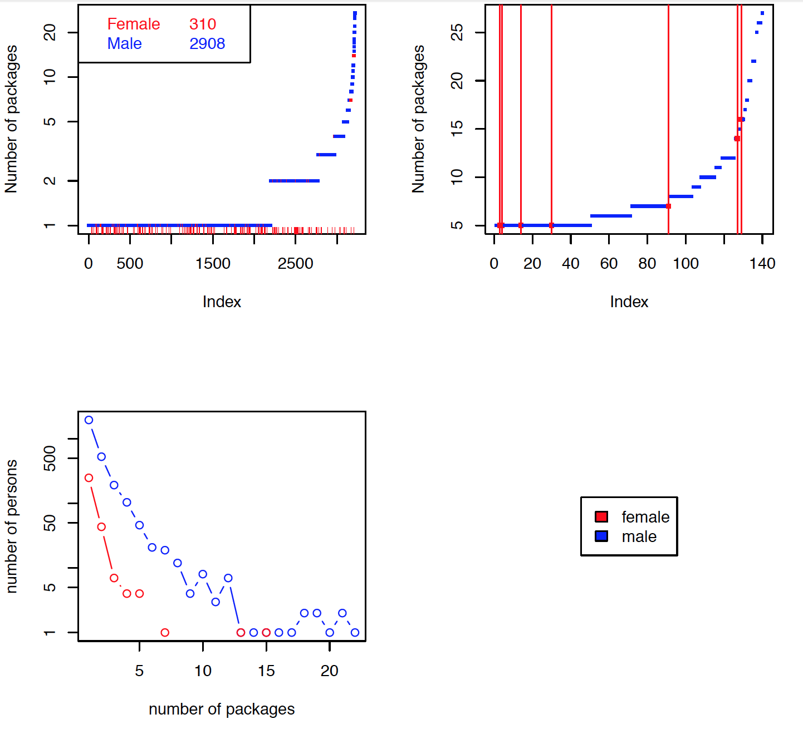

<h2 style="color: #837E7C;">Thank You to Our Sponsors</h2>

 

 

---

<h2 style="color: #837E7C;">Panelist Introductions</h2>

* Gabriela Queiroz
* Heather Turner
* Karline Soetaert
* Amelia Mcnamara
* Vivian Zhang

---

  Why the "heR Panel"?

---

<h2 style="color: #837E7C;"> R's Gender Gap </h2>

Gender Gap Study [Source Code](https://github.com/skoval/her2014)

---

<h2 style="color: #837E7C;">  Package Maintainers </h2>

**Contributed by Karline Soetaert**, [Source Code](https://github.com/skoval/her2014)

---

  As women R programmers we are an exception. How did we get here?

---

  Why is there a higher percentage of women in statistical fields than the percentage active in the R community?

---

  What do we love about R?

---

  Are there challenges that come with being female <i>and</i> a statistical programmer? What are they?

---

  Why aren't more women contributing R packages?

  Are barriers to development different than barriers to use?

---

  Are we ever treated differently by other useRs for being female?

  How and in which occasions?

---

  What could be done to increase the representation of women in the R community?

---

  What could be done to encourage more women to contribute R packages?

  What efforts are underway?

---

  Can we achieve greater gender equality by simply <i>leaning in</i> or is institutional change needed?

---

  Do events focusing on women help or harm the gender gap?

---

  What are the benefits of narrowing R's gender gap?

---

  Audience Questions

